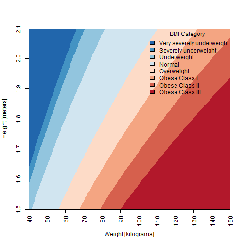

My Awesome BMI App
========================================================
author: Rafael Lohn
date: 20th September 2014
transition: fade

An app to calculate BMI.

The BMI
========================================================
transition: fade
The BMI, Body Mass Index, is a measure of relative 
weight based on an individual's mass and height.
This is the formula with the international standard
of using kilograms for weight and meters for height:


```r
weigh/height^2
```

BMI Categories
========================================================
transition: fade
The World Health Organization (WHO) categorizes 
the BMI ranges as such:

<table style='margin: 1em 0;
background-color: #f9f9f9;
border: 1px #aaa solid;
border-collapse: collapse;
color: black;'>
<tbody><tr>
<th>BMI range - kg/m<sup>2</sup></th>
<th>Category</th>
</tr>
<tr>
<td>less than 15</td>
<td>Very severely underweight</td>
</tr>
<tr>
<td>from 15.0 to 16.0</td>
<td>Severely underweight</td>
</tr>
<tr>
<td>from 16.0 to 18.5</td>
<td>Underweight</td>
</tr>
<tr>
<td>from 18.5 to 25</td>
<td>Normal (healthy weight)</td>
</tr>
<tr>
<td>from 25 to 30</td>
<td>Overweight</td>
</tr>
<tr>
<td>from 30 to 35</td>
<td>Obese Class I (Moderately obese)</td>
</tr>
<tr>
<td>from 35 to 40</td>
<td>Obese Class II (Severely obese)</td>
</tr>
<tr>
<td>over 40</td>
<td>Obese Class III (Very severely obese)</td>
</tr>
</tbody></table>

The BMI Graph
========================================================
transition: fade
Do you know where your BMI falls in this graph?
 

The App
========================================================
transition: fade
Head to http://rafalohn.shinyapps.io/PA_DataProducts
to interactivly play with heights and weight and see
where the associate BMI fall in the graph and what is its 
WHO category.

Enjoy!

(code at: http://github.com/rafalohn/PA_DataProducts)
